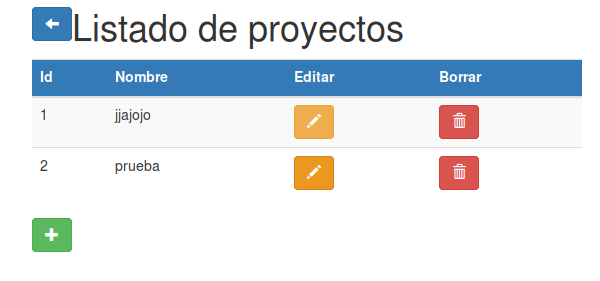
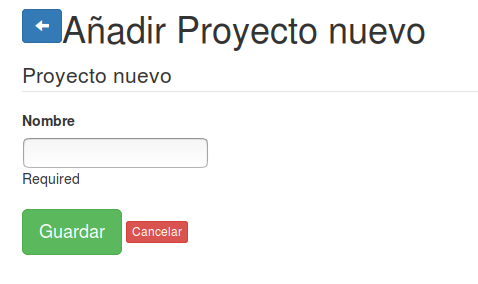

#MADS_ToDoList

Javier Molpeceres Gomez
Jorge Segovia Tormo
Adrian Gosálvez Maciá
Alberto Sapiña Mora

***

#Documentación

## Para el desarollador 

Se han añadido las siguientes funcionalidades:

### Login, registro y tamaño estimado de tareas

En primer lugar el logín ahora nos rediccionará al logearse el usuario al listado de tareas.

```java
@Transactional
public Result entrarLogin() {

        Form<Usuario> user = formFactory.form(Usuario.class).bindFromRequest();  

        try{
            Usuario usuario = user.get();

            boolean entra = UsuariosService.loginUsuario(usuario);

            if(entra){
                //Recupero el usuario 
                Usuario userRecu = UsuariosService.existeLogin(usuario);

                List<Tarea> tareas = TareasService.listaTareasUsuario(userRecu.id);

                return ok(listaTareas.render(tareas, userRecu));
            }
            else{
                return badRequest(paginaInicioLR.render(user, "Login incorrecto"));  
            }
        }
        catch(Exception e){
            return badRequest(paginaInicioLR.render(user, "Datos incorrectos, rellenar los campos"));  
        }

        
        
    }
```

Ahora las tareas tienen un nuevo atributo que nos indica el tamaño de la tarea.

```java
public Integer duracion=0;
public String tamano="Sin tamaño";
```

Este se mostrará en la lista de tareas junto a su tarea correspondiente.

Para añadir una duracion a una tarea podrá seleccionarse en la creacion de la tarea o en la edicion de la tarea.

### Proyectos

Esta nueva funcionalidad nos permite crear,borrar y editar los proyectos.

Estos proyectos estan formados por Tareas que se pueden asignar.

```java
@Entity
public class Proyecto {
    @Id
    @GeneratedValue(strategy=GenerationType.AUTO)
    public Integer id;
    @Constraints.Required
    public String nombre;

    // Un constructor vacío necesario para JPA
    public Proyecto() {
    }

    // El constructor principal con los campos obligatorios
    public Proyecto(String nombre) {
        this.nombre = nombre;
    }

    public String toString() {
        //return String.format("Proyecto id: %s nombre: %s", id, nombre);
        return String.format("%s", nombre);
    }
    public Proyecto copy() {
        Proyecto nuevo 	= new Proyecto(this.nombre);
        nuevo.id 		= this.id;
        return nuevo;
    }

    @Override
    public int hashCode() {
        final int prime = 31;
        int result = prime + ((nombre == null) ? 0 : nombre.hashCode());
        return result;
    }

    @Override
    public boolean equals(Object obj) {
        if (this == obj) return true;
        if (getClass() != obj.getClass()) return false;
        Proyecto other = (Proyecto) obj;
        // Si tenemos los ID, comparamos por ID
        if (id != null && other.id != null)
            return (id == other.id);
        // sino comparamos por campos obligatorios
        else {
            if (nombre == null) {
                if (other.nombre != null) return false;
            } else if (!nombre.equals(other.nombre)) return false;
        }
        return true;
    }

    @OneToMany(mappedBy="proyecto")
    public List<Tarea> tareas = new ArrayList<Tarea>();
}

```

La asignacion se realiza de la siguiente manera:

```java
    @Transactional
    public Result AsignarProyecto(Integer id){
      Tarea tarea = TareasService.findTarea(id);
      
      String proyectoNombre="";
      if(tarea.proyecto!=null){
        proyectoNombre=tarea.proyecto.nombre;
      }
      
      List<Proyecto> proyectos = ProyectosService.findAllProyectos();

      return ok(AsignarProyecto.render(proyectos,tarea,proyectoNombre,""));
    }

    @Transactional
    public Result RealizarAsignacion(Integer idt,Integer idp){

      List<Proyecto> proyectos = ProyectosService.findAllProyectos();
      Tarea tarea= TareasService.findTarea(idt);
      Proyecto proyecto = ProyectosService.find(idp);

      if(TareasService.AsignarProyecto(tarea,proyecto)){
          return ok();
      }else{
          return badRequest();
      }
    }
```

Los proyectos pueden ser editados,borrados y creados.


## Para el Cliente 

Se han añadido las siguientes funcionalidades:

### Login, registro y tamaño estimado de tareas

Ahora las tareas tienen una duracción que se muestraen la lista de tareas.


Para añadir una duracion a una tarea podrá seleccionarse en la creacion de la tarea o en la edicion de la tarea.


### Proyectos

Se han creado los proyectos los cuales agrupan tareas que pueden ser asignadas a estos.

Se puede obtener una lista de proyectos:



Se pueden crear proyectos pulsando en el boton +:



Editar pulsando en el boton de edicion y borrar con el boton de borrado.