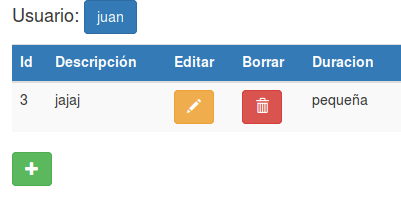
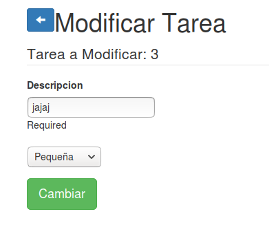
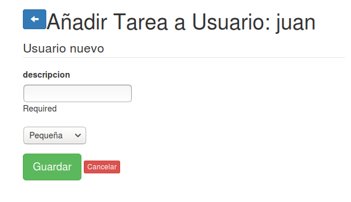

#MADS_ToDoList

Javier Molpeceres Gomez
Jorge Segovia Tormo
Adrian Gosálvez Maciá
Alberto Sapiña Mora

***

#Documentación

## Para el desarollador 

Se han añadido las siguientes funcionalidades:

### Login, registro y tamaño estimado de tareas

En primer lugar el logín ahora nos rediccionará al logearse el usuario al listado de tareas.

```java
    @Transactional
    public Result entrarLogin() {

        Form<Usuario> user = formFactory.form(Usuario.class).bindFromRequest();  

        try{
            Usuario usuario = user.get();

            boolean entra = UsuariosService.loginUsuario(usuario);

            if(entra){
                //Recupero el usuario 
                Usuario userRecu = UsuariosService.existeLogin(usuario);

                List<Tarea> tareas = TareasService.listaTareasUsuario(userRecu.id);

                return ok(listaTareas.render(tareas, userRecu));
            }
            else{
                return badRequest(paginaInicioLR.render(user, "Login incorrecto"));  
            }
        }
        catch(Exception e){
            return badRequest(paginaInicioLR.render(user, "Datos incorrectos, rellenar los campos"));  
        }

        
        
    }
```

Ahora las tareas tienen un nuevo atributo que nos indica el tamaño de la tarea.

```java

    public Integer duracion=0;
    public String tamano="Sin tamaño";

```

Este se mostrará en la lista de tareas junto a su tarea correspondiente.

Para añadir una duracion a una tarea podrá seleccionarse en la creacion de la tarea o en la edicion de la tarea.

## Para el Cliente 

Se han añadido las siguientes funcionalidades:

### Login, registro y tamaño estimado de tareas

Ahora las tareas tienen una duracción que se muestraen la lista de tareas.



Para añadir una duracion a una tarea podrá seleccionarse en la creacion de la tarea o en la edicion de la tarea.



