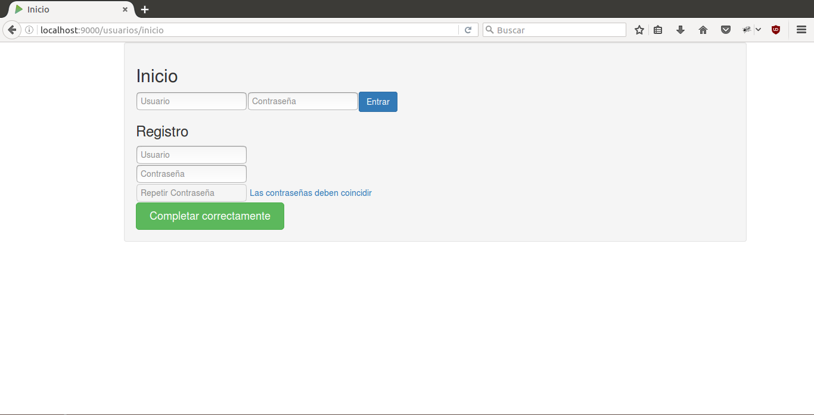
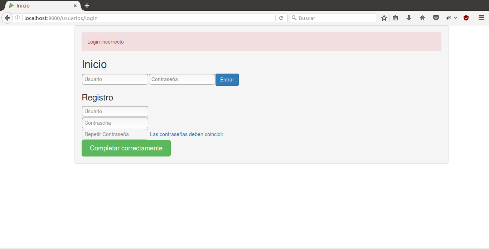
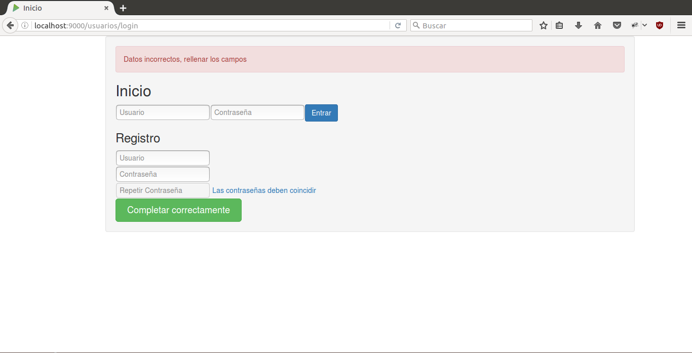
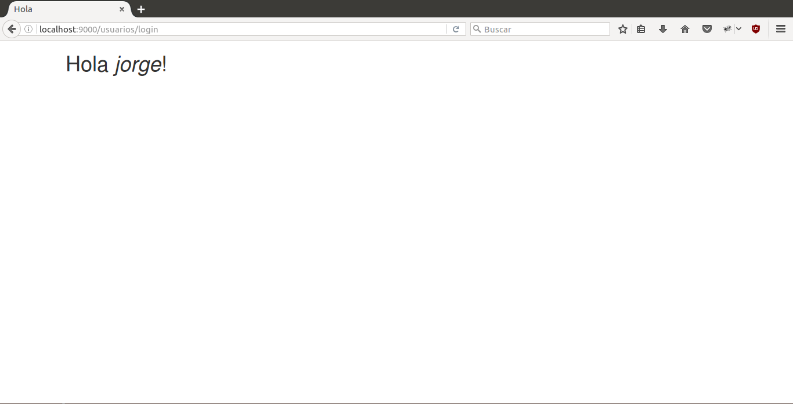
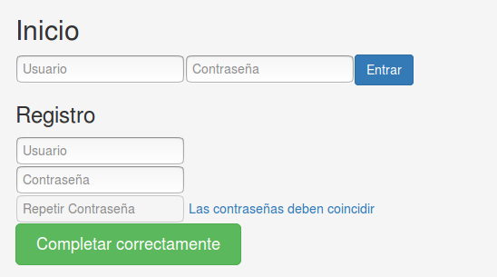
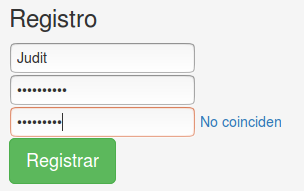
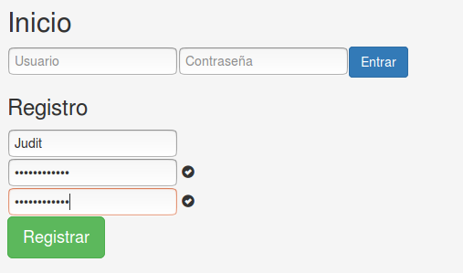
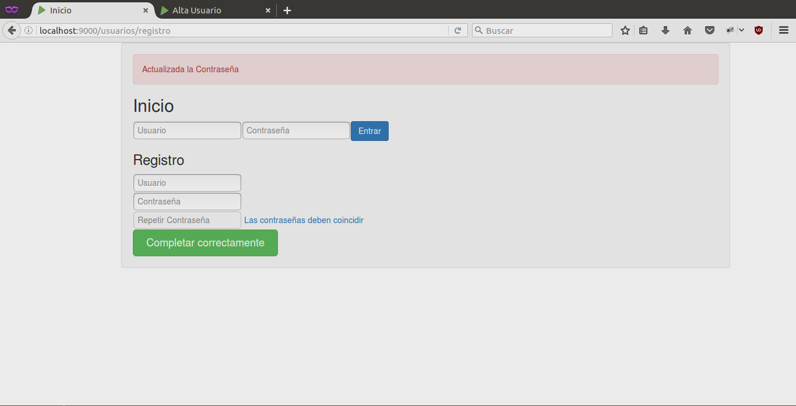

#MADS_ToDoList#


Jorge Sgovia Tormo
***

# Documentación #

##Para el desarrollador##

Hemos creado 3 peticiones, una GET y dos POST

`GET    /usuarios/inicio             controllers.UsuarioController.paginaInicio()`

`POST    /usuarios/login             controllers.UsuarioController.entrarLogin()`

`POST    /usuarios/registro         controllers.UsuarioController.registrarUsuario()`


##GET paginaInicio
La primera carga la página de inicio en la que usamos javascript para comprobar los campos de los formularios y mostrar los mensajes de error.

`GET    /usuarios/inicio             controllers.UsuarioController.paginaInicio()`

Empezamos con la peticón en el archivo *routes*. La llamada UsuarioController.paginaInicio():

```java    
@Transactional
public Result paginaInicio() {
   Form<Usuario> user = formFactory.form(Usuario.class).bindFromRequest();  
        Logger.debug("Llamada página de inicio");  
        return ok(paginaInicioLR.render(user, ""));
}
```
Aquí nos rederigimos al view con un mensaje de ok() que contiene un Form<Usuario> a rellenar en el view y un mensaje para la plantilla. En este caso pasamos un mensaje vacio "" porque no queremos notificar nada al usuario al cargar de forma inicial la view.

ahora entramos en el view --> `paginadeInicioLR.scala.html`
Recibe el Form<Usuario> y el mensaje creado con anterioridad.
Siguiendo este esqueleto en scala:
```scala
@(usuarioForm: Form[Usuario], mensaje: String)
@scripts = {
	//scrips en javascript para realizar en ejecución
}
@main("Inicio",scripts) {
	@helper.form(){
    	//Formulario 1, para la autenticación Login y password
    }
    @helper.form(){
    	//Formulario 2, para el Registro de Login, password y comprobacion de la misma
    }
}
```
Empezamos con la primera parte, la del javascrip dentro de @scripts = {}.
###Scripts JavaScript###

```javascript
    	$(document).ready(function(){ //Arranca con la carga de la web
            $("#checkuno").hide();
            $("#checkdos").hide();//checkuno y checkdos son elementos visuales para verificar contraseñas
            document.getElementById("passdos").disabled = true //bloquea la introduccion de texto en la comprobación de contraseña
            document.getElementById("Registrar").type = "disable" //Bloqueamos el botón de registrar 
            document.getElementById("Registrar").value = "Completar correctamente"//Cambiamos el valor del boton Registrar
       		setTimeout(function(){$("#temporal").hide();  }, 3000)//Establecemos un tiempo para cada vez que se cargue un mensaje al entrar en la pagina
		});

        function check(input) {//comprueba que los input de la contraseña y la reptición sea el mismo y si lo son muestra el check y elimina el mensaje "no coinciden"
            if (input.value != document.getElementById("passuno").value || input.value == "") {
           		document.getElementById("mensPass").text = "No coinciden"
                $("#checkuno").hide();
                $("#checkdos").hide();
                document.getElementById("Registrar").type = "disable"
                document.getElementById("Registrar").value = "Completar correctamente"
             } else {//Si coincide cambia el valor del boton a Registrar, y desbloquea el botón poniendolo en type submit. También muestra los check
                document.getElementById("mensPass").text = ""
            	$("#checkuno").show();
                $("#checkdos").show();
                document.getElementById("Registrar").type = "submit"
                document.getElementById("Registrar").value = "Registrar"
            }
        }
        function long(input){//Comprueba que la contraseña tenga un mínimo de 7 carácteres
        	var texto = input.value.toString().length
        	if(texto < 7){
        		var mensaje = document.getElementById("mensLong")
        		var longitud = 7 - input.value.toString().length
        		mensaje.text = "minimo 7 caracteres, faltan " + longitud
                document.getElementById("passdos").disabled = true
        	}
        	else{
        		document.getElementById("mensLong").text = ""
                document.getElementById("passdos").disabled = false
        	}
        } 
   }

```
###Código HTML/Scala###

```html
<div class="col-xs-push-1 col-xs-11 well">

          @if(mensaje != "") { <!-- Mensaje de aviso, solo en caso de necesitar algun aviso -->
                <div class="alert alert-danger" id="temporal">
                    @mensaje
                </div>
            }

             <h2>Inicio</h2>    
            <div>
            <table>
            @helper.form(action = routes.UsuarioController.entrarLogin()) { <!-- Primer form, usado para el Login y hacer el POST a entrarLogin() con el valor con name "login" y "password" -->
                <tr>
                    <input type="text" id="login_form1" name="login" value='' placeholder="Usuario">
                </tr>
                <tr>
                    <input type="password" id="password_form1" name="password" value='' placeholder="Contraseña">
                </tr>   
                <tr>
                    <input type="submit" class="btn btn-primary btn-md" id="Entrar" value="Entrar">
                </tr>
            </table>
            }
            </div>

            <h3>Registro</h3>       

           @helper.form(action = routes.UsuarioController.registrarUsuario()) { <!-- Segundo Form, usado para registrar y hacer el POST a registrarUsuario() con el valor de "login" y password -->
                <div>
                    <input type="text" id="login_form2" name="login" value='' placeholder="Usuario">
                </div>
                <div>
                    <input type="password" id="passuno" name="password" value='' placeholder="Contraseña" oninput="long(this)"> 
                    <a id="mensLong"></a>
                    <span class="glyphicon glyphicon-ok-sign" id="checkuno" placeholder="Contraseña" "></span>
                </div>

                <div>
                     <input type="password" id="passdos" name="Comprobar" value='' placeholder="Repetir Contraseña" oninput="check(this)">
                     <a id="mensPass">Las contraseñas deben coincidir</a> 
                     <span class="glyphicon glyphicon-ok-sign" id="checkdos"></span>
                </div>

                <div>
                    <input type="submit" class="btn btn-success btn-lg" id="Registrar" value="Registrar">
                </div>
            }
</div>
```

##entrarLogin()##
En el segundo simplemente se usa para comprobar que el existe la dupla Login, password, que envia desde el form1 del view visto anteriormente.
Cuando se hace la petición vista anteriormete:

```html
	 @helper.form(action = routes.UsuarioController.entrarLogin()) { <!-- Primer form, usado para el Login y hacer el POST a entrarLogin() con el valor con name "login" y "password" -->
                <tr>
                    <input type="text" id="login_form1" name="login" value='' placeholder="Usuario">
                </tr>
                <tr>
                    <input type="password" id="password_form1" name="password" value='' placeholder="Contraseña">
                </tr>   
                <tr>
                    <input type="submit" class="btn btn-primary btn-md" id="Entrar" value="Entrar">
                </tr>
            </table>
            }
```

Este envia en forma de POST a UsuarioController.entrarLogin() el login y pasword, en un form<Usuario>

En UsuarioController nos encontramos con:

```java
    @Transactional
    public Result entrarLogin() {

        Form<Usuario> user = formFactory.form(Usuario.class).bindFromRequest();  //captura el Form<Usuario>

        try{
            Usuario usuario = user.get();//Pasa de Form<Usuario> a Usuario
            boolean entra = UsuariosService.loginUsuario(usuario);//Esta llamada comprueba si el usuario contraseña es correcto y se asigna a true si lo es o false si no lo es

            if(entra){//Si es correcto entra y pasa a la pagina de saludo con un mensaje ok() donde se le pasa un String del nombre del usuario que acaba de autentificarse
                Logger.debug(usuario.login.toString());
                return ok(saludo.render(usuario.login.toString()));
            }
            else{//En el caso contrario regarga la página de inicio con un mensaje de error
                return badRequest(paginaInicioLR.render(user, "Login incorrecto"));  
            }
        }
        catch(Exception e){//Si captura el error significa que el formato del Usuario es incorrecto, porejemplo pasar un usuario sin Login, y recargaria la página de inicio con el mensaje de error necesario
            return badRequest(paginaInicioLR.render(user, "Datos incorrectos, rellenar los campos"));  
        } 
        
    }
```

Pasamos a ver como comprueba si el usuario es correcto o no.
`boolean entra = UsuariosService.loginUsuario(usuario);`
Esto nos lleva a UsaurioService.loginUsuario(usuario):

```java
        public static boolean loginUsuario(Usuario user) {
            return UsuarioDAO.LoginUsuario(user);
        }     
```
Nos dirige a UsuarioDAO.LoginUsuario(user):
```java
public static boolean LoginUsuario(Usuario user) {
    List<Usuario> result = (List<Usuario>) JPA.em().createQuery(
        "select u from Usuario u WHERE login = '" 
        + user.login + "' AND password ='"+ user.password + "'", Usuario.class).getResultList();
        return (result.size() == 1);
    }
```
Esto realiza una consulta donde busca en la base de datos un usuario con el login y el password capturados. Recupera una lista, y si la lista tiene tamaño 1 es correcto.


##registrarUsuario##
El tercero se usa para el registro, devolviendo los mensajes segun sean necesarios:

1. Usuario ya existe

2. Usuario actualizado (caso en el que el login existe sin contraseña)

3. Usuario creado de 0.

Este POST sale del form2 del view visto del GET anterior. Con la petición:

```html
@helper.form(action = routes.UsuarioController.registrarUsuario()) {
                <div>
                    <input type="text" id="login_form2" name="login" value='' placeholder="Usuario">
                </div>
                <div>
                    <input type="password" id="passuno" name="password" value='' placeholder="Contraseña" oninput="long(this)"> 
                    <a id="mensLong"></a>
                    <span class="glyphicon glyphicon-ok-sign" id="checkuno" placeholder="Contraseña" "></span>
                </div>

                <div>
                     <input type="password" id="passdos" name="Comprobar" value='' placeholder="Repetir Contraseña" oninput="check(this)">
                     <a id="mensPass">Las contraseñas deben coincidir</a> 
                     <span class="glyphicon glyphicon-ok-sign" id="checkdos"></span>
                </div>

                <div>
                    <input type="submit" class="btn btn-success btn-lg" id="Registrar" value="Registrar">
                </div>
            }
```

Este envia a UsuarioController.registrarUsuario() el login y password en un form.

En UsuarioController nos encontramos con:

```java

@Transactional
    public Result registrarUsuario() {

        Form<Usuario> user = formFactory.form(Usuario.class).bindFromRequest();

        if(user.hasErrors()){
            return badRequest(paginaInicioLR.render(user, "Error en los campos"));
        }

        Usuario usuario = user.get();

        boolean existe = UsuariosService.existeUsuarioConPass(usuario);//TIENE LOGIN Y NO PASS

        if(existe){//Si existe mensaje de error
            return badRequest(paginaInicioLR.render(user, "El usuario ya existe"));        
        }else{//Si no existe se registra o actualiza
            try{//esta el login solo falta el pass
                Usuario sUsuario = UsuariosService.existeLogin(usuario);
                usuario.id=sUsuario.id;
                usuario.nombre = sUsuario.nombre;
                usuario.apellidos = sUsuario.apellidos;
                usuario.eMail = sUsuario.eMail;
                usuario.fechaNacimiento = sUsuario.fechaNacimiento;
                usuario = UsuariosService.modificaUsuario(usuario);
                return ok(paginaInicioLR.render(user, "Actualizada la Contraseña"));

            }catch(Exception e){//no existen referencias al usuario
                UsuariosService.crearUsuario(usuario);//se ha comprobado ya si existe o no, no hace falta controlar aqui la no repeticion del login
                return ok(paginaInicioLR.render(user, "El usuario no existía y ha sido creado"));
            }
        }  
   }

```
En primer lugar buscamos que exista el Login con contraseña.
`boolean existe = UsuariosService.existeUsuarioConPass(usuario);`
Pasamos a UsuarioService

```java
public static boolean existeUsuarioConPass(Usuario user) {
   try{//Intenta capturar el usuario, si no puede salta la excepción
       Usuario a=UsuarioDAO.ExisteLoginConPass(user);
       return true;//Tiene pass
      }
      catch(Exception e){
 	    return false;//no tiene pass
      }
 }
```

```java
    public static Usuario ExisteLoginConPass(Usuario user) {
        TypedQuery<Usuario> result = JPA.em().createQuery(
            "select u from Usuario u WHERE login = :login AND password IS NOT NULL ", Usuario.class);
        
        return result.setParameter("login", user.login).getSingleResult();
    }
```
Hace una sentencia a la base de datos donde recupera el usuario en una lista de usuario que tienen contraseñas. Si no existe ese nombre de usuario en esa lista proboca la excepción anterior.

Volvemos al UsuarioController.registrarUsuario() en la línea:
`boolean existe = UsuariosService.existeUsuarioConPass(usuario);`
Con lo visto anteriormente, si es true significa que el usuario tiene contraseña. En este caso volveria a inicio con el mensaje correspondiente.

```java
if(existe){
  return badRequest(paginaInicioLR.render(user, "El usuario ya existe"));        
  }
```
En el caso contrario, false pasamos al else:

```java
try{//esta el login solo falta el pass
                Usuario sUsuario = UsuariosService.existeLogin(usuario);
                usuario.id=sUsuario.id;
                usuario.nombre = sUsuario.nombre;
                usuario.apellidos = sUsuario.apellidos;
                usuario.eMail = sUsuario.eMail;
                usuario.fechaNacimiento = sUsuario.fechaNacimiento;
                usuario = UsuariosService.modificaUsuario(usuario);
                return ok(paginaInicioLR.render(user, "Actualizada la Contraseña"));

            }catch(Exception e){//no existen referencias al usuario
                UsuariosService.crearUsuario(usuario);//se ha comprobado ya si existe o no, no hace falta controlar aqui la no repeticion del login
                return ok(paginaInicioLR.render(user, "El usuario no existía y ha sido creado"));
            }
```
Pasamos entonces a la sentencia que puede probocar la excepción:
`Usuario sUsuario = UsuariosService.existeLogin(usuario);`
Esto nos lleva a UsuarioService:
```java
public static Usuario existeLogin(Usuario user) {
	return UsuarioDAO.ExisteLogin(user);
}
```
UsuarioService nos lleva a UsuarioDAO.existeLogin, dónde se hace la consulta:

```java
public static Usuario ExisteLogin(Usuario user) {
	TypedQuery<Usuario> result = JPA.em().createQuery(	
    	"select u from Usuario u WHERE login = :login", Usuario.class);
        return result.setParameter("login", user.login).getSingleResult();
    }
```
Este recupera el usuario con el login pedido y si existe lo devuelve hasta llegar al controller, y si no, provocará la excepción en el controller.

Si existe copia todos los elementos del usuario capturado:
```java
                Usuario sUsuario = UsuariosService.existeLogin(usuario);
                usuario.id=sUsuario.id;
                usuario.nombre = sUsuario.nombre;
                usuario.apellidos = sUsuario.apellidos;
                usuario.eMail = sUsuario.eMail;
                usuario.fechaNacimiento = sUsuario.fechaNacimiento;
                usuario = UsuariosService.modificaUsuario(usuario);
                
                return ok(paginaInicioLR.render(user, "Actualizada la Contraseña"));
```
Por último devuelve un ok con el mensaje de se actualiza la contraseña, que es lo que realiza al usuario recuperado.

Si no existe y provoca la excepción:

```java
catch(Exception e){//no existen referencias al usuario
                UsuariosService.crearUsuario(usuario);//se ha comprobado ya si existe o no, no hace falta controlar aqui la no repeticion del login
                return ok(paginaInicioLR.render(user, "El usuario no existía y ha sido creado"));
            }
```

En este caso crea un usuario y envía el mensaje de que todo ha ido bien. 

* * *

##Para el usuario##


Para iniciar sesión, registrarnos o completar el registro con un nombre de usuario ya existente, tenemos la siguiente pantalla:


En la barra de arriba, en los recuadros de *Usuario*, *Contraseña* y boton *Entrar*. Se usa para iniciar sesión teniendo **usuario** y **contraseña**. En el caso de que algún campo sea incorrecto recibiremos el siguiente mensaje de error:

En el caso de que no sea correcto el formato enviado:



En el caso contrario, en el que todo vaya bien pasaremos a la pantalla de saludo al usuario:



_____

Para registrarnos necesitamos completar el formulario con tres recuadros, que corresponden a **Usuario**, **Contraeña** y **Repetir contraseña**.

Para ello deberemos elegir un nombre de usuario, una contraseña y repetir la misma en la casilla de debajo.
La primera casilla no tiene ningun tipo de limitación, la segunda, para la contraseña te pide un mínimo de 7 caracteres y sin eso no desbloquea el siguiente cuadro para repetir la contraseña, y la tercera te pide coincidir con la segunda (al coincidir cambia el valor del botón); en el momento de que estas dos coincidan quedará remarcado con ticks de verificación.






Aquí pueden darse 3 casos.
El usuario ya existe, y daria este mensaje de error:


El usuario ya existe, pero no tenia contraseña por lo que se actualizaría:


El usuario no existe, por lo tanto se crea de 0:


***
